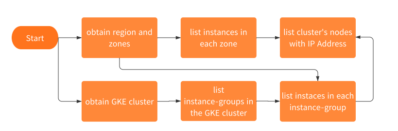

# mock-google-cloud-sdk-compute
This is a mockup for confirming behavior of context cancel, parallel requests using google api.

# overview of processing

# feature of sample coding
- CLI option parser by spf13/cobra
- Logging stdout and file simultaneously by logrus
- Configuration loading from toml by BurntSushi/toml
- Fetching and manipulating resources from GCP by googleapi
- Handling goroutine with errgroup and propagation with context canceling by sync/context package